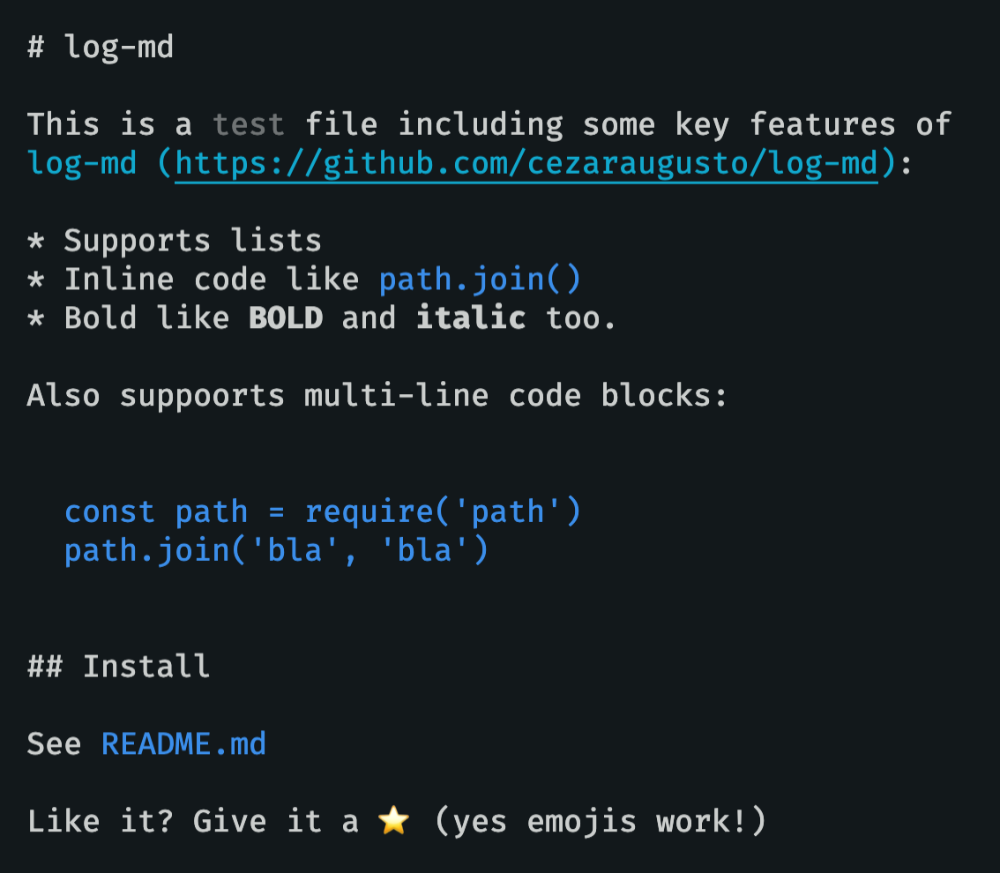

[npm-image]: https://img.shields.io/npm/v/log-md.svg
[npm-url]: https://npmjs.org/package/log-md

# log-md [![npm][npm-image]][npm-url]

> Output Markdown using console.log for CLI

<p align="center">

</p>

## Installation

```
npm install log-md
```

## Usage

Outputs the message in the image above

```js
import {log} from 'log-md'

log(`
  # log-md

  This is a ~~test~~ file including some key features of
  [log-md](https://github.com/cezaraugusto/log-md):

  * Supports lists
  * Inline code like \`path.join()\`
  * Bold like **BOLD** and __italic__ too.

  Also supports multi-line code blocks:

  \`\`\`
    const path = require('path')
    path.join('bla', 'bla')
  \`\`\`

  ## Install

  See \`README.md\`

  Like it? Give it a ⭐️ (yes emojis work!)
`)
```

## API

### log(message, gutter?)

#### message

Type: `string`

The markdown message you want to parse.

#### gutter

Type: `boolean`\
Default: `false`

Adds a line-break on top and botton of your messages.

## License

MIT (c) Cezar Augusto.
